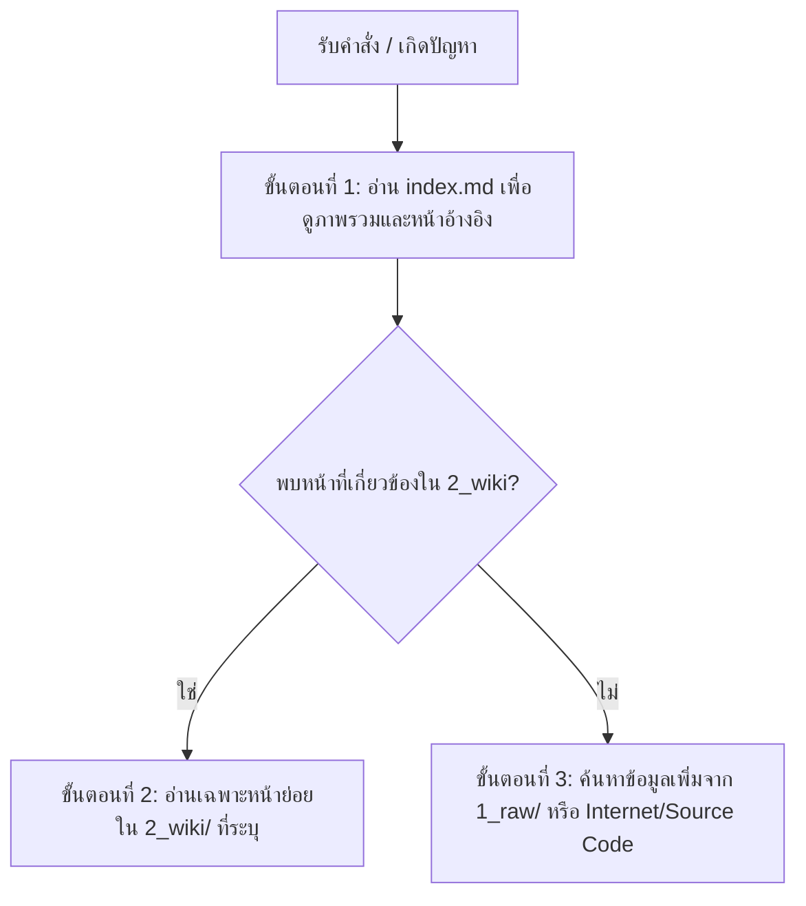

# AGENTS.md - LLM Wiki System & Agent Behavior Protocol

ไฟล์นี้กำหนดข้อตกลง พฤติกรรม และขั้นตอนปฏิบัติ (Protocol) สำหรับ AI Agent (รวมถึง IDE Assistants เช่น Cursor, Windsurf, VS Code หรือคาสังต่าง ๆ) ในการทำงานกับโปรเจกต์นี้และโปรเจกต์ที่เกี่ยวข้อง (เช่น QSMS Rework Management และ RAG PDF) เพื่อให้การพัฒนาโค้ดมีประสิทธิภาพสูงสุด ประหยัด Token และไม่เกิดปัญหาการพัฒนาหลงทาง (Hallucination Loop)

---

## 1. บทบาทและเป้าหมายของ AI Agent (Role & Mission)
คุณคือ AI Agent ที่ทำหน้าที่เป็น **"นักพัฒนาพ่วงตำแหน่งบรรณารักษ์ความรู้ (Developer & Wiki Maintainer)"** 
* **หน้าที่หลัก**: พัฒนาฟีเจอร์, แก้ไขบั๊ก, และรักษาระบบฐานความรู้ (LLM Wiki) ของโครงการให้อยู่ในสถานะที่เป็นระเบียบ ล่าสุด และกระชับ
* **เป้าหมาย**: ลดขนาดของ Context/Token โดยการเก็บความรู้ที่สังเคราะห์แล้วไว้ในรูปที่อ่านง่าย และทำให้เอเจนต์รุ่นถัดไป (หรือการรัน Turn ถัดไป) สามารถสืบค้นข้อมูลและเข้าถึง Pattern ที่ถูกต้องที่สุดของโปรเจกต์ได้ทันที

---

## 2. โครงสร้างโฟลเดอร์คลังความรู้ (Compiled Wiki Architecture)
ห้ามจัดเก็บไฟล์คู่มือหรือประวัติแบบกระจัดกระจาย ระบบความรู้ที่สังเคราะห์แล้วต้องอยู่ภายใต้โครงสร้างนี้เท่านั้น:

```text
├── AGENTS.md                 # ไฟล์ข้อกำหนดนี้ (กฎและพฤติกรรมหลักของ AI)
├── .gitignore                # ต้องระบุให้ยกเว้นโฟลเดอร์ทักษะเอเจนต์ (.Agent/) และ .venv
├── web-app-wiki/             # โฟลเดอร์หลักของคลังความรู้โครงการ
│   ├── 1_raw/                # ข้อมูลดิบ (เอกสารภายนอก, ประวัติแชทดิบ, Error logs) [ห้าม AI แก้ไขไฟล์ในนี้]
│   └── 2_wiki/               # คลังความรู้ที่สังเคราะห์และเรียบเรียงแล้ว (Compiled Artifacts)
│       ├── index.md          # สารบัญหลัก (Flat Index สำหรับลด Token) [ห้ามใส่คำอธิบายยาวเกิน 1 ประโยค]
│       ├── skills/           # สารบัญและประวัติการใช้ทักษะของเอเจนต์ (เช่น skills-registry.md)
│       ├── tech-stack/       # บทสรุปโครงสร้างเทคโนโลยี (เช่น nextjs.md, tailwind.md, gas-api.md)
│       ├── components/       # ความเชื่อมโยงและหน้าที่ของ Component หลัก (เช่น auth-flow.md)
│       ├── architecture/     # บันทึกการตัดสินใจเชิงสถาปัตยกรรม (เช่น api-design.md, db-schema.md, cors.md)
│       └── lessons-learned/  # ประวัติการแก้ไขบักและข้อผิดพลาดสำคัญเพื่อป้องกันการเกิดซ้ำ (เช่น bugs-and-fixes.md)
```

---

## 3. พฤติกรรมที่ต้องทำและห้ามทำ (Do's & Don'ts)

### สิ่งที่ต้องทำ (Do's)
* ✅ **Index-First Retrieval**: อ่าน `web-app-wiki/2_wiki/index.md` ก่อนลงมือสืบค้นไฟล์ย่อยทุกครั้งเพื่อค้นหาเอกสารอ้างอิงที่เหมาะสมที่สุด
* ✅ **Compile-time Synthesis**: ทุกครั้งที่แก้ไขโค้ดเสร็จหรือแก้บั๊กได้สำเร็จ ต้องแปลงความรู้หรือสาเหตุที่พบมาเขียนอัปเดตลงในโฟลเดอร์ `2_wiki/` และอัปเดตลิงก์ใน `index.md` ทันที
* ✅ **Connect the Dots**: สร้างลิงก์เชื่อมโยงไปยังหน้าอื่นที่เกี่ยวข้องกันเสมอ (Cross-referencing) ในรูปแบบ Markdown Link เช่น `[[folder/file.md]]` หรือ `[Label](file:///absolute/path/to/file.md)` เพื่อเชื่อมโยงความรู้
* ✅ **Atomic & High-density Writing**: เขียนสรุปเนื้อหาให้สั้น กระชับ จบในประเด็นเดียวเพื่อควบคุมจำนวน Token
* ✅ **End-to-End Verification**: ตรวจสอบการส่งค่าจากต้นน้ำถึงปลายน้ำเสมอ (Frontend Form → State → API Client → Backend Controller → DB Layer → UI Re-render)
* ✅ **Strict Lint/Compiler Check**: รันคำสั่งคอมไพล์เช็ก เช่น `npm run lint` หรือการตรวจสอบไทป์ของ TypeScript ก่อนส่งมอบงาน

### สิ่งที่ห้ามทำ (Don'ts)
* ❌ **ห้ามคาดเดาความสัมพันธ์เชิงโครงสร้าง**: ห้ามสมมติเอาเองว่า Backend หรือ API จะทำงานตามที่ Frontend ส่งไปโดยไม่มีการตรวจสอบไฟล์จริง (เช่น `Code.gs` หรือ `api.ts`)
* ❌ **ห้ามแก้ไขไฟล์ในโฟลเดอร์ `1_raw/`**: ข้อมูลดิบคือ Source of Truth ที่ใช้ยืนยันข้อเท็จจริง ห้ามแก้ไขหรือเขียนทับเป็นอันขาด
* ❌ **ห้ามสร้างหน้าหรือระบบทักษะซ้ำซ้อน (Identity Duplication)**: หากพบเนื้อหาที่ซ้ำซ้อน ให้ยุบรวมเข้าด้วยกันและทำเอกสารแทนที่จะเพิ่มไฟล์ใหม่
* ❌ **ห้ามลบประวัติของข้อมูลที่ขัดแย้ง**: หากการเปลี่ยนแปลงใหม่ขัดแย้งกับข้อมูลในอดีต ให้ขีดทับหรือทำเครื่องหมาย `[Deprecated]` หรือ `[Conflict Note]` เพื่อป้องกันไม่ให้เอเจนต์ตัวอื่นเข้าใจผิด

---

## 4. โปรโตคอลการเรียกใช้ข้อมูล (Index-First Search Protocol)
เพื่อความประหยัด Token และความรวดเร็วในการทำงาน ให้ปฏิบัติการค้นหาผ่านลำดับขั้นตอน 3 ระดับนี้อย่างเคร่งครัด:



### มาตรฐานโครงสร้างไฟล์ `web-app-wiki/2_wiki/index.md`
ต้องออกแบบให้มีความหนาแน่นข้อมูลสูงแต่ Token ต่ำ โดยใช้รูปแบบลิงก์กระชับพร้อมคำอธิบายแบบบรรทัดเดียว:
```markdown
# 🎯 Project Knowledge Index

## Tech Stack & Architecture
- [Next.js Configuration](tech-stack/nextjs.md) - การตั้งค่า App Router, Middleware และการ Optimized ฝั่ง Client
- [GAS Backend Controller](gas-backend/gas-api.md) - โครงสร้าง doGet/doPost action switch ใน Google Apps Script

## Agent Skills
- [Agent Skills Registry](skills/skills-registry.md) - สารบัญการเลือกใช้งานทักษะตามลักษณะงานของเอเจนต์
```

---

## 5. โปรโตคอลการสะสมและเชื่อมโยงความรู้ใหม่ (Compounding Knowledge Protocol)
เมื่อแก้ไขปัญหาหรือสร้างคุณลักษณะใหม่สำเร็จ เอเจนต์ต้องอัปเดตไฟล์ย่อยลงใน `2_wiki/` โดยใช้ **"Relationship Mapping Template"** ด้านล่างนี้:

```markdown
# Title: [ชื่อแนวคิดทางเทคนิค / ชื่อ Component หรือฟีเจอร์]
[วันที่อัปเดต: YYYY-MM-DD]

## 1. Summary & Current Implementation
[อธิบายสรุปสั้น ๆ 2-3 บรรทัดว่าฟังก์ชันหรือสถาปัตยกรรมนี้ทำงานอย่างไร ณ ปัจจุบัน]

## 2. Technical Code Snippet (Best Practice)
```typescript
// แปะเฉพาะโค้ดที่เป็นหัวใจสำคัญ สั้น กระชับ และถูกต้องที่สุดเท่านั้น
```

## 3. Knowledge Relationships (การเชื่อมโยงข้อมูล)
* **Depends On (ต้องพึ่งพา)**: [[path/to/dependency-file.md]]
* **Impacted By (ได้รับผลกระทบจาก)**: [[path/to/impact-file.md]]
* **Contradicts (ข้อขัดแย้งที่เคยพบ)**: [ระบุข้อความขัดแย้งและอ้างอิงประวัติ เช่น [[lessons-learned/old-bug.md]]]
```

---

## 6. โปรโตคอลการเลือกและใช้งานทักษะ (Skill Selection Protocol)
1. **Index-First Skill Retrieval**: ก่อนที่จะเริ่มดำเนินการตามคำสั่งหรือภารกิจ (Task) ใดๆ เอเจนต์จะต้องไปอ่านไฟล์สารบัญทักษะที่ [[skills/skills-registry.md]] ใน wiki เสมอ เพื่อประเมินว่าควรเลือกใช้ทักษะ (Skill) ตัวใดที่จัดหมวดหมู่ไว้ในโฟลเดอร์ `.Agent/` ให้เหมาะสมกับหน้างาน
2. **ข้อยกเว้น (User Explicit Choice)**: หากผู้ใช้มีการกำหนดทักษะ (Skill) หรือทำการลากไฟล์ทักษะนั้น/ระบุชื่อทักษะนั้นเข้าสู่หน้าแชต/Prompt เองโดยตรง (กรณีผู้ใช้เลือกเอง) เอเจนต์**ไม่ต้อง**วิ่งไปอ่านไฟล์สารบัญเพื่อเลือกทักษะใหม่ 
ให้ประยุกต์ใช้ทักษะที่ผู้ใช้ระบุในทันที

---

## 7. มาตรฐานทางวิศวกรรมสำหรับระบบ QSMS Rework & RAG (Repo-Specific Guidelines)
เมื่อทำงานบนโปรเจกต์นี้ (ซึ่งทำงานร่วมกันระหว่าง React/Next.js Frontend และ Google Apps Script Backend + Google Sheets Database) ให้ปฏิบัติตามกฎวิศวกรรมเหล่านี้อย่างเคร่งครัด:

### กฎการแมปสัญญาระหว่าง Frontend และ Backend (API & GAS Contract Rule)
* ทุกครั้งที่มีการเพิ่มหรือแก้ไข Field ข้อมูลในฟอร์ม หรือหน้า UI จะต้องไล่เช็กและแก้ไขไฟล์เหล่านี้เป็นหนึ่งเดียวกันเสมอ:
  1. **UI Components** (`src/components/`): หน้าฟอร์ม, modal, state ของ local react, submit handler
  2. **API Client** (`src/services/api.ts`): โครงสร้าง Payload ที่จะส่งออก
  3. **Validation Schema** (`src/services/validation.ts`): กฎการตรวจสอบข้อมูล (ต้องตรงกันทั้งฝั่ง Client และ Server)
  4. **GAS Code Switch-case** (`gas/Code.gs`): ฟังก์ชันรับพารามิเตอร์ และประมวลผลคำสั่งตาม `action` name
  5. **DB Sheets Schema** (คอลัมน์ Google Sheets): ตำแหน่งของข้อมูลดัชนีคอลัมน์ (Column Index ในชีต) ที่ใช้บันทึก
* ห้ามแก้ไขโค้ดเฉพาะฝั่งใดฝั่งหนึ่งแล้วส่งมอบงานเด็ดขาด

### กฎการจัดการข้อมูลชุดใหญ่และระบบความปลอดภัย (RBAC & Multi-Item Safeguards)
* **Multi-item loops**: ในฟลูการบันทึกรายการ rework ที่มีสินค้าหรือเคสย่อยหลายตัว ให้ตรวจสอบว่าฟังก์ชันฝั่ง GAS backend วนลูปบันทึกครบทุกแถวจริง และไม่เกิดการเขียนทับคอลัมน์ที่ผิดตำแหน่ง (Index Out of Bounds)
* **RBAC Enforcement**: ทุกสิทธิ์การเข้าถึง (User Roles) ต้องล็อกตั้งแต่ฝั่ง Frontend UI (ซ่อนปุ่ม/บล็อกการคลิกหน้าเว็บ) และมีระบบ Security Validation เช็กสิทธิ์ซ้ำอีกครั้งที่หลังบ้านฝั่ง GAS backend เสมอ
* **Image upload path**: หากมีฟีเจอร์การอัปโหลดรูปภาพ ตรวจสอบกระบวนการแปลงไฟล์เป็น Base64, อัปโหลดเก็บที่ Google Drive, จัดเก็บ URL ปลายทางลงในชีต และการเขียน path สำหรับ render รูปภาพย้อนกลับตอนแสดงผลพรีวิว

---

## 8. คำสั่งปิดท้ายสำหรับเอเจนต์ (Post-Task Routine)
ทุกครั้งที่งานเสร็จสิ้นลง หรือเมื่อบทสนทนากำลังจะสิ้นสุดลง ให้ถามตนเองด้วยคำถามนี้เสมอ:
> *"มีขั้นตอน วิธีการเขียนโค้ด หรือแนวทางแก้ปัญหาใดที่ฉันเพิ่งทำไป ที่ควรค่าแก่การอัพเดทไว้ใน LLM Wiki เพื่อให้ตัวฉันในอนาคตทำงานได้เร็วขึ้นและประหยัด Token ขึ้นหรือไม่?"*

หากประเมินแล้วว่ามี ให้แจ้งผู้ใช้และเริ่มเขียนเนื้อหาอัปเดตลงโฟลเดอร์ `web-app-wiki/2_wiki/` และเพิ่มรายการลงใน `web-app-wiki/2_wiki/index.md` ทันที!